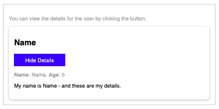

# ACDM-ReactJSwithStyledComponents-20191009

> Academind - Why you should look into these React component styling options! (Oct 9, 2019)

Link: https://www.youtube.com/watch?v=NMiEREulVLc

**Description**
> Styling React components is easy and difficult at the same time. There are so many options! Inline styles, styled components, vanilla CSS, CSS modules and more. Let's take a closer look at the best alternatives!

This video comes with an article you shouldn't miss! You also find all the source code links there: https://www.academind.com/learn/react...

Article Link: https://academind.com/tutorials/inline-styles-styled-components-css/

---


> TABLE OF CONTENTS
- [ACDM-ReactJSwithStyledComponents-20191009](#acdm-reactjswithstyledcomponents-20191009)
- [1 - Project Setup](#1---project-setup)
- [2 - Installing Styled Components](#2---installing-styled-components)
- [3 - Using Styled Components](#3---using-styled-components)
  - [Example Usage within component](#example-usage-within-component)
  - [Example Usage from external file](#example-usage-from-external-file)
- [4 - Styled Components vs CSS + CSS Modules](#4---styled-components-vs-css--css-modules)
- [Getting Started with Create React App](#getting-started-with-create-react-app)
  - [Available Scripts](#available-scripts)
    - [`yarn start`](#yarn-start)
    - [`yarn test`](#yarn-test)
    - [`yarn build`](#yarn-build)
    - [`yarn eject`](#yarn-eject)
  - [Learn More](#learn-more)
    - [Code Splitting](#code-splitting)
    - [Analyzing the Bundle Size](#analyzing-the-bundle-size)
    - [Making a Progressive Web App](#making-a-progressive-web-app)
    - [Advanced Configuration](#advanced-configuration)
    - [Deployment](#deployment)
    - [`yarn build` fails to minify](#yarn-build-fails-to-minify)

---
# 1 - Project Setup

```bash
npx create-react-app acdm-reactjswithstyledcomponents-20191009
cd acdm-reactjswithstyledcomponents-20191009
yarn start
```

In src/, leave only :

- components
    - Button.js
    - UserDetails.js
    - UserSummary.js
- App.js
- index.css
- index.js

Then get the starting state here:

[academind/react-styling](https://github.com/academind/react-styling/tree/01-starting-state/src)

# 2 - Installing Styled Components

```bash
yarn add styled-components
```

# 3 - Using Styled Components

## Example Usage within component

App.js 

```jsx
// START: IMPORTS
import React from 'react'
import styled from 'styled-components'

// Start: Import Components
import UserSummary from './components/UserSummary'
// End: Import Components
// END: IMPORTS

// Start: Styled Components
const StyledDiv = styled.div`
  width:90%;
  max-width:40rem;
  margin: 2rem auto;
  border:1px solid #ccc;
  padding:1rem;
  
`
// End: Styled Components

// Start: Template
const App = () => {
  return (
    <StyledDiv>
      <UserSummary />
    </StyledDiv>
  )
}
// End: Template

export default App
```

## Example Usage from external file

create new components/StyledParagraph.js:

```jsx
import styled from 'styled-components'

const StyledParagraph = styled.p`
  color:#aaa
`
export default StyledParagraph;
```

components/UserSummary.js

```jsx
import React, { useState } from 'react';

import UserDetails from './UserDetails';
import Button from './Button';

import StyledParagraph from './StyledParagraph'

const UserSummary = () => {
  const [detailsVisible, setDetailsVisible] = useState(false);

  return (
    <section>
      <StyledParagraph>You can view the details for the user by clicking the button.</StyledParagraph>
      <div
        style={{
          boxShadow: '0 2px 6px rgba(0, 0, 0, 0.26)',
          padding: '1rem',
          borderRadius: '10px'
        }}
      >
        <h2>Name</h2>
        <Button onClick={() => setDetailsVisible(curVisible => !curVisible)}>
          {detailsVisible ? 'Hide' : 'Show'} Details
        </Button>
        {detailsVisible && <UserDetails name="Name" age="0" />}
      </div>
    </section>
  );
};

export default UserSummary;
```

components/UserDetails.js

```jsx
import React from 'react';
import StyledParagraph from './StyledParagraph'

const UserDetails = props => {
  return (
    <div>
      <StyledParagraph>
        <strong>Name</strong>: {props.name}, <strong>Age</strong>: {props.age}
      </StyledParagraph>
      <p>My name is {props.name} - and these are my details.</p>
    </div>
  );
};

export default UserDetails;
```

# 4 - Styled Components vs CSS + CSS Modules

create new components/Button.module.css

```css
.button {
  font: inherit;
  cursor: pointer;
  border: 1px solid blue;
  background: blue;
  color: white;
  padding: 0.5rem 2rem;
}

.button:focus {
  outline: none;
}

.button:hover,
.button:active {
  background: lightblue;
  color: blue;
  border-color: lightblue;
}
```

components/Button.js

```jsx
import React from 'react'
import classes from './Button.module.css';

// import styled from 'styled-components'

// const Button = styled.button`
//   font:inherit;
//   cursor:pointer;
//   border:1px solid blue;
//   color:white;
//   background:blue;
//   padding:0.5rem 2rem;

//   :focus{
//     outline:none;
//   }

//   :hover, :active{
//     background:lightblue;
//     color:blue;
//     border-color:lightblue;
//   }
// `

const Button = props => {
  return <button className={classes.button} onClick={props.onClick}>{props.children}</button>
};

export default Button;
```

what this done then is then assign the div elements with a unique identifier due to using css modules instead of just mere classes.

Which can be easier or better to use instead of Styled Components.


---
# Getting Started with Create React App

This project was bootstrapped with [Create React App](https://github.com/facebook/create-react-app).

## Available Scripts

In the project directory, you can run:

### `yarn start`

Runs the app in the development mode.\
Open [http://localhost:3000](http://localhost:3000) to view it in the browser.

The page will reload if you make edits.\
You will also see any lint errors in the console.

### `yarn test`

Launches the test runner in the interactive watch mode.\
See the section about [running tests](https://facebook.github.io/create-react-app/docs/running-tests) for more information.

### `yarn build`

Builds the app for production to the `build` folder.\
It correctly bundles React in production mode and optimizes the build for the best performance.

The build is minified and the filenames include the hashes.\
Your app is ready to be deployed!

See the section about [deployment](https://facebook.github.io/create-react-app/docs/deployment) for more information.

### `yarn eject`

**Note: this is a one-way operation. Once you `eject`, you can’t go back!**

If you aren’t satisfied with the build tool and configuration choices, you can `eject` at any time. This command will remove the single build dependency from your project.

Instead, it will copy all the configuration files and the transitive dependencies (webpack, Babel, ESLint, etc) right into your project so you have full control over them. All of the commands except `eject` will still work, but they will point to the copied scripts so you can tweak them. At this point you’re on your own.

You don’t have to ever use `eject`. The curated feature set is suitable for small and middle deployments, and you shouldn’t feel obligated to use this feature. However we understand that this tool wouldn’t be useful if you couldn’t customize it when you are ready for it.

## Learn More

You can learn more in the [Create React App documentation](https://facebook.github.io/create-react-app/docs/getting-started).

To learn React, check out the [React documentation](https://reactjs.org/).

### Code Splitting

This section has moved here: [https://facebook.github.io/create-react-app/docs/code-splitting](https://facebook.github.io/create-react-app/docs/code-splitting)

### Analyzing the Bundle Size

This section has moved here: [https://facebook.github.io/create-react-app/docs/analyzing-the-bundle-size](https://facebook.github.io/create-react-app/docs/analyzing-the-bundle-size)

### Making a Progressive Web App

This section has moved here: [https://facebook.github.io/create-react-app/docs/making-a-progressive-web-app](https://facebook.github.io/create-react-app/docs/making-a-progressive-web-app)

### Advanced Configuration

This section has moved here: [https://facebook.github.io/create-react-app/docs/advanced-configuration](https://facebook.github.io/create-react-app/docs/advanced-configuration)

### Deployment

This section has moved here: [https://facebook.github.io/create-react-app/docs/deployment](https://facebook.github.io/create-react-app/docs/deployment)

### `yarn build` fails to minify

This section has moved here: [https://facebook.github.io/create-react-app/docs/troubleshooting#npm-run-build-fails-to-minify](https://facebook.github.io/create-react-app/docs/troubleshooting#npm-run-build-fails-to-minify)
